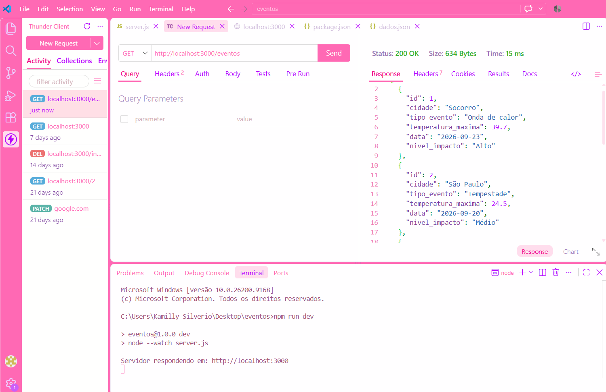
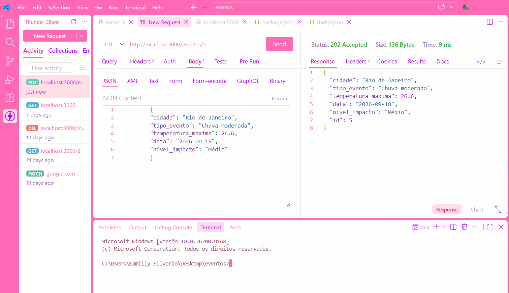
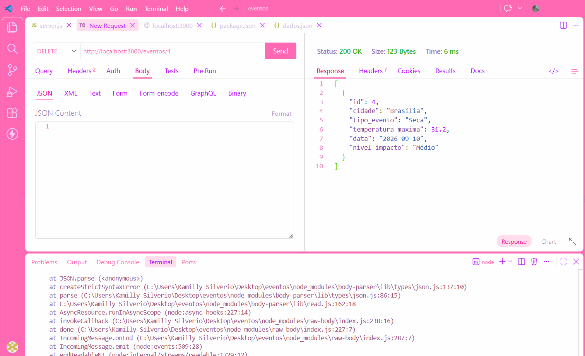
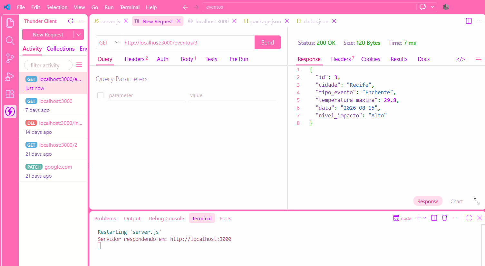
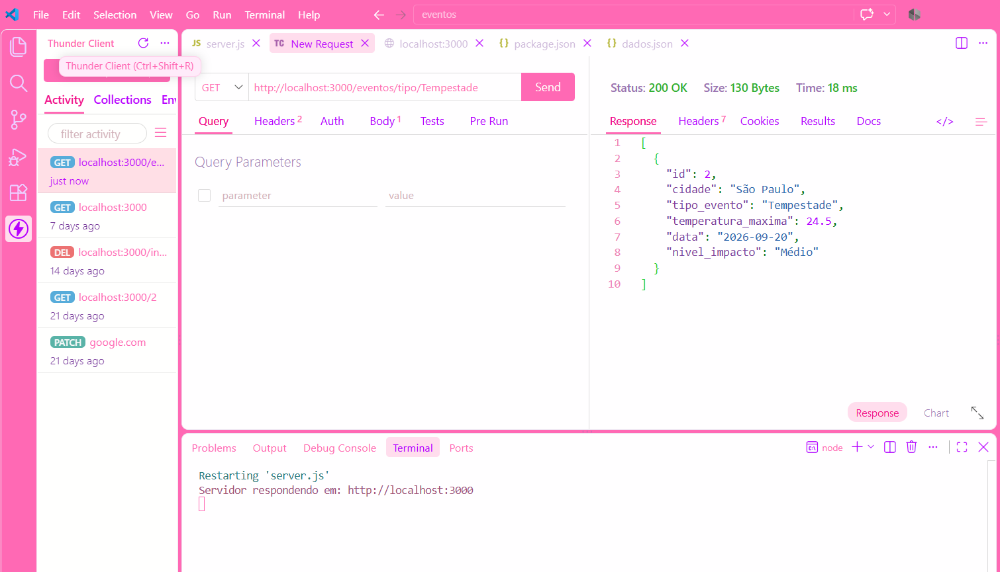
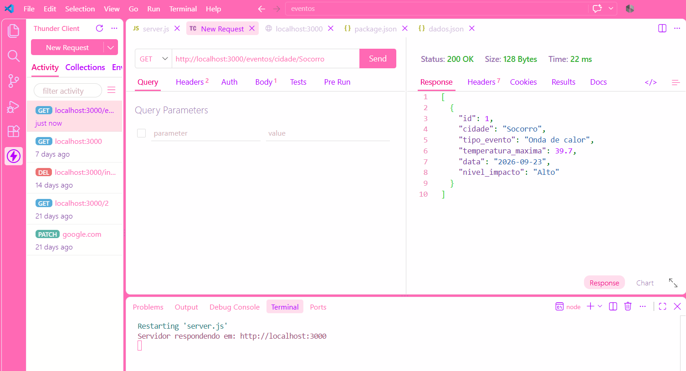
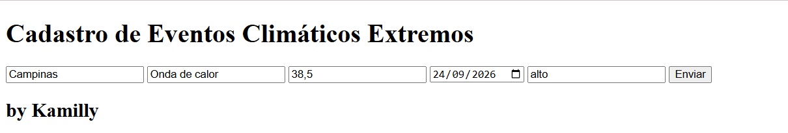
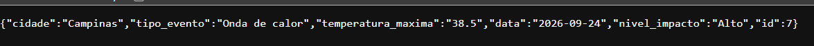

# Registro de Eventos Climáticos Extremos Back-end

Exemplo de back-end para registrar eventos climáticos extremos, como ondas de calor, tempestades, secas e enchentes, utilizando dados JSON e funcionalidades CRUD padrão.

---

## Tecnologias

- **Node.js**
- **JavaScript**
- **VSCode**
- **VSCode** Thunder Client
- **HTML**

---

## Passos para testar

- 1 Clone este repositório
- 2 Abra com **VSCode** e em um terminal digite:

```bash
npm install
npm run dev
```

- 3 Teste as rotas com a extensão `Thunder Client` do **VSCode**
- 4 Abra o arquivo `client/index.html` com a extensão `Live Server` do **VSCode**

---

## Print dos testes e exemplo de requisições

- Cadastrar novo equipamento: 
 
 
 
- Ler todos os eventos climáticos: 
 
 
 
- Atualizar um evento climáticos por ID: 
 
 
 
- Deletar um evento climático por ID: 
 
 
 
- Buscar um evento climático específico por ID: 
 
 
 
- Buscar por um tipo de evento climáticos: 
 
 
 
- Buscar por cidade: 
 
 
 

---

## Cliente

- 

- Resposta:
- 


O formulário permite cadastrar um novo evento climático por meio da rota POST /eventos.

```json
{
    "cidade": "Campinas",
    "tipo_evento": "Onda de calor",
    "temperatura_maxima": "38.5",
    "data": "2026-09-24",
    "nivel_impacto": "alto",
    "id": 6
}
```
